# ForgeDB – Technical Documentation (Stage3)

Updated Full Version

# Project Overview

ForgeDB is a platform designed to help users transform raw data from CSV files, Excel spreadsheets, and external REST APIs into a structured relational database. The system saves the imported data inside ForgeDB, analyzes its structure and quality, generates a database design in DBML format, converts the approved design into PostgreSQL SQL statements, and deploys the final schema to PostgreSQL.

The goal of ForgeDB is to reduce the time and effort required to understand raw datasets and design databases manually. It provides an automated workflow from data ingestion to data analysis, DBML generation, dashboard preview, SQL generation, and database deployment.

ForgeDB also provides a simple fixed dashboard for every imported dataset. The dashboard displays general metrics such as total rows, total columns, missing values, duplicate records, detected data types, data preview, and recommended charts. AI may be used as an optional assistant to recommend chart configurations from predefined chart templates, including the chart type, selected columns, aggregation method, and chart title.

| Item | Details |
| --- | --- |
| Input Sources | CSV files, Excel spreadsheets, and user-provided REST APIs. |
| Stored Data | Imported datasets, dataset rows, detected columns, analysis results, DBML, SQL scripts, dashboard metrics, and deployment records. |
| Database Design Format | DBML is used as the main editable representation of generated database designs. |
| Deployment Target | PostgreSQL. |
| AI Scope | Optional AI-assisted chart configuration and data insight suggestions. AI does not build the dashboard UI from scratch. |

# 0. User Stories and Mockups

This section defines the main user requirements for the ForgeDB MVP using the MoSCoW prioritization method. It also lists the main user interface mockups that should be prepared in Figma and inserted as final exported images before submission.

## User Stories

| Priority | ID | User Story |
| --- | --- | --- |
| Must Have | US-01 | As a user, I want to upload CSV and Excel files, so that I can use existing datasets to generate a database. |
| Must Have | US-02 | As a user, I want to connect an external API, so that I can import data directly from external systems. |
| Must Have | US-03 | As a user, I want ForgeDB to save my imported data, so that I can access and analyze it later. |
| Must Have | US-04 | As a user, I want ForgeDB to analyze imported data automatically, so that I can understand its structure and quality. |
| Must Have | US-05 | As a user, I want ForgeDB to detect data types, missing values, duplicate records, and possible relationships, so that I can review the dataset before generating a schema. |
| Must Have | US-06 | As a user, I want ForgeDB to generate DBML from the analyzed data, so that I can review the database design in a readable format. |
| Must Have | US-07 | As a user, I want ForgeDB to convert the approved DBML into PostgreSQL SQL statements, so that I can deploy the database. |
| Must Have | US-08 | As a user, I want to review and modify the generated schema, so that I can customize it before deployment. |
| Must Have | US-09 | As a user, I want ForgeDB to deploy the approved schema to PostgreSQL, so that the database becomes ready for use. |
| Should Have | US-10 | As a user, I want to view a simple fixed dashboard for each imported dataset, so that I can understand dataset size, quality, and structure. |
| Should Have | US-11 | As a user, I want to visualize relationships between generated tables, so that I can better understand the database structure. |
| Should Have | US-12 | As a user, I want ForgeDB to generate SQL scripts, so that I can deploy databases manually if required. |
| Could Have | US-13 | As a user, I want AI-assisted chart recommendations, so that ForgeDB can suggest suitable chart types, values, aggregations, and chart titles from predefined chart templates. |
| Could Have | US-14 | As a user, I want AI-assisted naming suggestions for tables and columns, so that the generated schema follows better naming practices. |
| Could Have | US-15 | As a user, I want to export database documentation, so that I can share the generated database design with my team. |
| Won’t Have (MVP) | US-16 | Multi-database support such as MySQL, SQL Server, and Oracle will not be included in the MVP. |
| Won’t Have (MVP) | US-17 | Real-time synchronization with external APIs will not be included in the MVP. |
| Won’t Have (MVP) | US-18 | A fully dynamic dashboard builder will not be included in the MVP; the dashboard will use predefined fixed templates. |

## Mockups

The following figures should be exported from Figma and inserted into this document. The placeholders below are intentionally left as notes so the team can replace them with the final mockup images.

Figma: https://www.figma.com/design/vh1KX783HJOcRFJN7L4V2T/html.to.design-%E2%80%94-by-%E2%80%B9div%E2%80%BARIOTS-%E2%80%94-Import-websites-to-Figma-designs--web-html-css---Community-?node-id=0-1&t=kQVorOzOaFBQLGp8-1

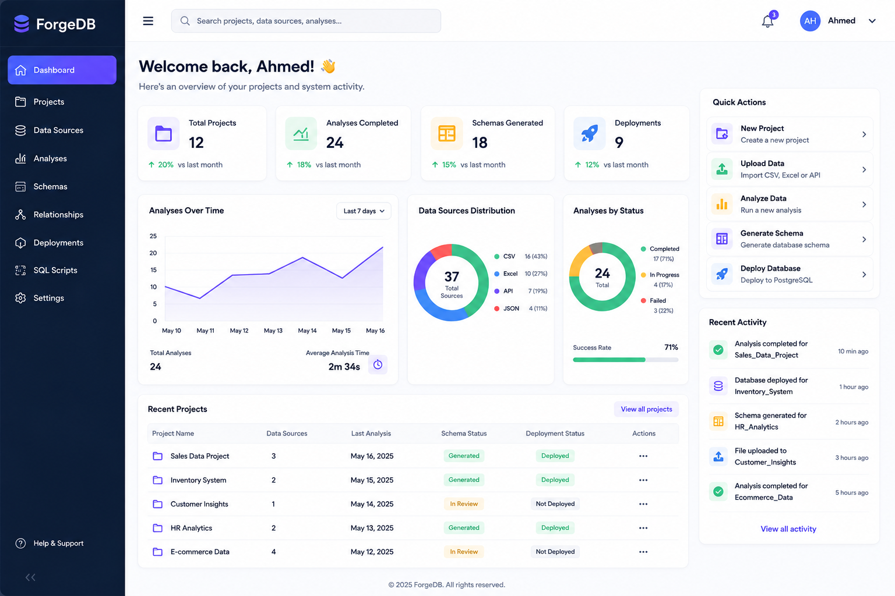

Description: The dashboard gives users a high-level overview of projects, imported datasets, saved schemas, deployments, and recent activity.

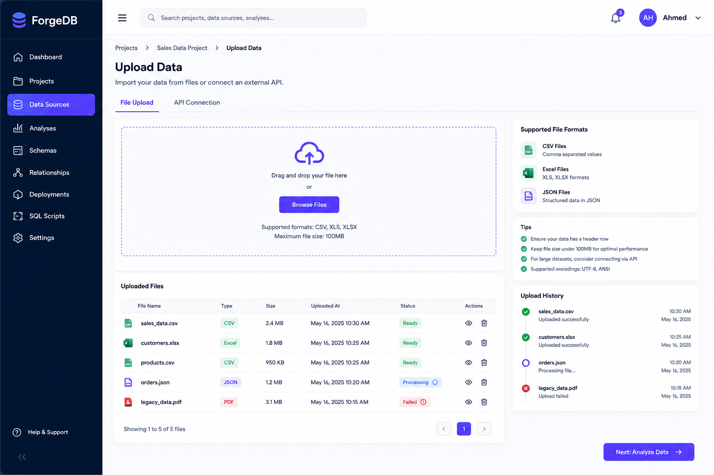

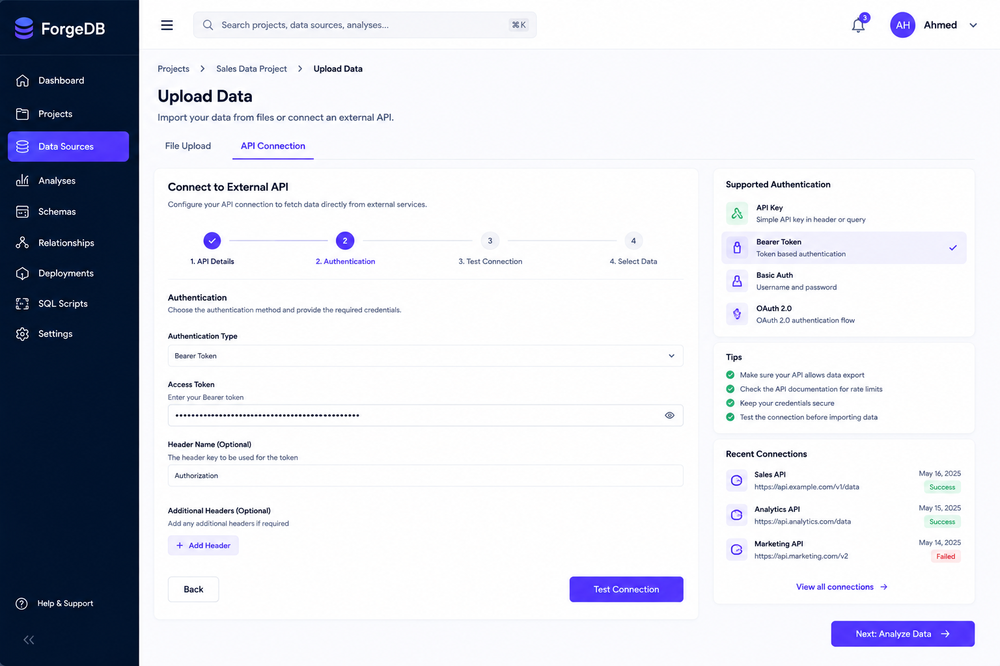

Description: This screen allows users to upload CSV or Excel files or connect an external REST API as a data source.

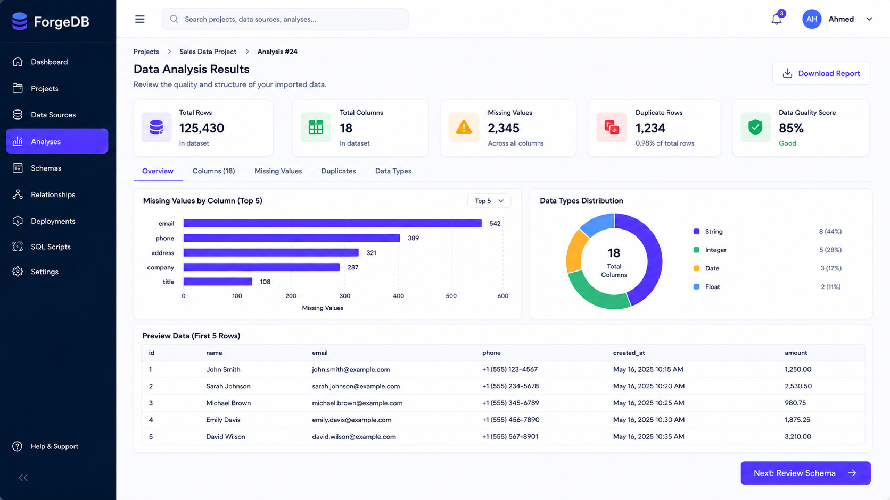

Description: This screen displays saved dataset metrics such as total rows, total columns, missing values, duplicates, data preview, and simple chart recommendations.

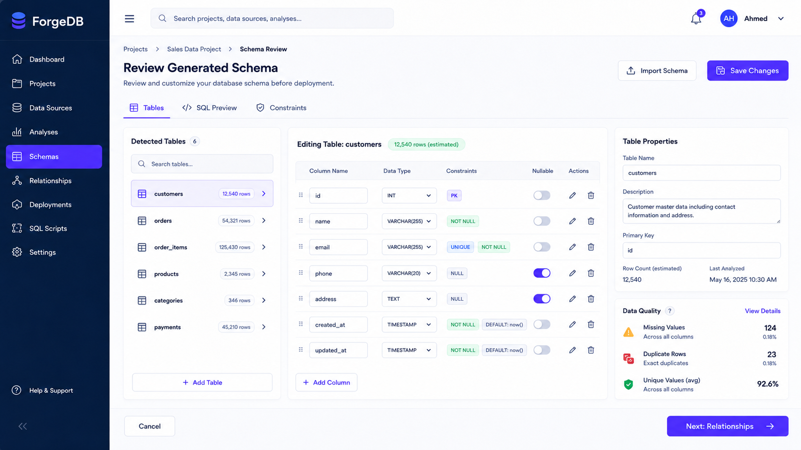

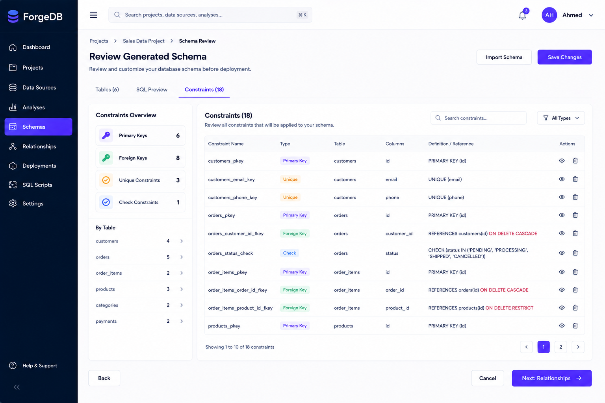

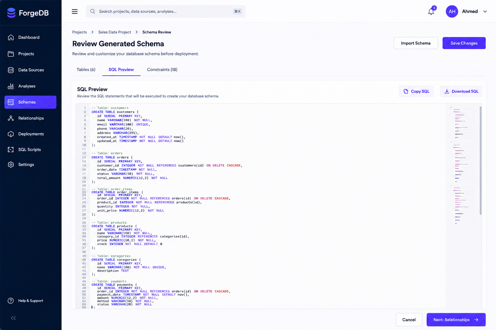

Description: This screen allows users to review generated tables, columns, relationships, DBML content, and SQL preview before deployment.

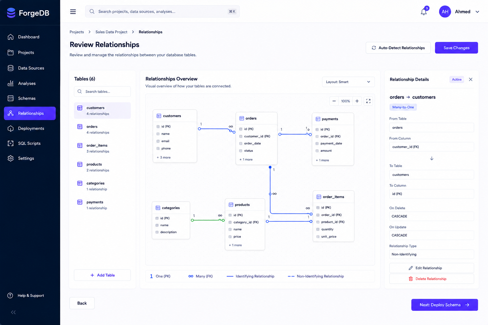

Description: This screen visualizes detected relationships between generated tables and helps users verify foreign keys before deployment.

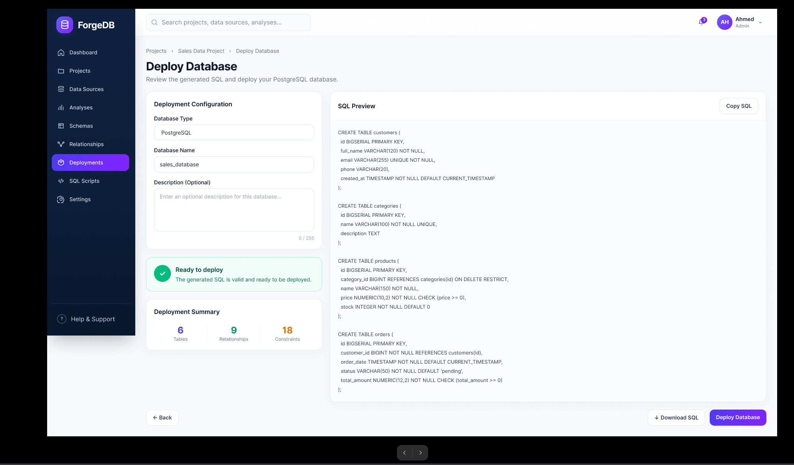

Description: This screen allows users to deploy the approved schema to PostgreSQL and view deployment status.

# 1. System Architecture

## Architecture Overview

ForgeDB follows a layered architecture. Each layer has a clear responsibility, which makes the system easier to maintain, test, and extend.

- Angular Frontend: handles the user interface, mockup flows, dashboard pages, schema review pages, and deployment screens.
- ASP.NET Core Backend: handles business logic, internal API endpoints, authentication, project management, dataset management, DBML generation flow, SQL generation flow, and deployment requests.
- Python Analysis Engine: analyzes imported data, detects column types, missing values, duplicates, possible relationships, and dataset statistics.
- Optional AI Assistant: recommends chart configurations and naming suggestions based on dataset metadata. It does not generate the UI from scratch.
- PostgreSQL Database: stores users, projects, imported datasets, dataset rows, analysis results, DBML schemas, SQL scripts, dashboard metrics, chart recommendations, and deployment records.

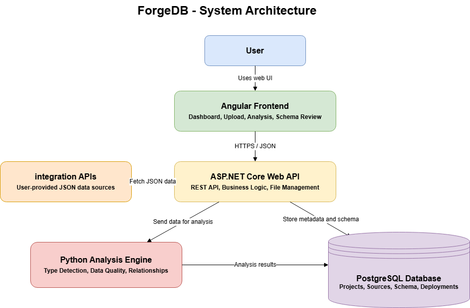

Description: The architecture diagram should show Angular Frontend, ASP.NET Core Backend, Python Analysis Engine, optional AI Assistant, and PostgreSQL Database.

## Updated Data Flow

1. The user uploads a CSV or Excel file, or connects an external REST API.
1. Angular Frontend sends the data source request to the ASP.NET Core API.
1. ASP.NET Core saves the data source metadata and imported data in PostgreSQL.
1. The backend sends dataset metadata and sample data to the Python Analysis Engine.
1. The Analysis Engine detects column types, missing values, duplicates, possible relationships, and basic statistics.
1. The analysis results and dashboard metrics are saved in PostgreSQL.
1. ForgeDB generates a DBML representation of the proposed database design.
1. The user reviews the DBML, generated tables, columns, and relationships.
1. The system converts the approved DBML into PostgreSQL SQL statements.
1. The approved SQL is deployed to PostgreSQL and the deployment status is saved.

# 2. Components, Classes, and Database Design

# Frontend Components

| Frontend Class / Component | Layer / Type | Description | Key Methods / Responsibilities |
| --- | --- | --- | --- |
| AppComponent | Root Component | Main Angular root component that loads the application shell and connects the main routing structure. | initializeApp(), loadUserSession() |
| LayoutComponent | Layout Component | Provides the main application layout, including sidebar, top navigation, content area, and shared page structure. | toggleSidebar(), renderContent() |
| SidebarComponent | Navigation Component | Displays the main navigation links for dashboard, upload data, analysis, schema review, relationships, and deployment. | navigateToPage(), highlightActiveRoute() |
| TopbarComponent | Navigation Component | Displays user information, project context, page title, and quick actions such as logout or profile access. | showUserMenu(), logout() |
| LoginComponent | Authentication Component | Allows users to sign in and stores authentication tokens after successful login. | submitLogin(), validateForm(), showLoginError() |
| RegisterComponent | Authentication Component | Allows new users to create an account before using ForgeDB. | submitRegistration(), validateForm() |
| ProjectListComponent | Project Component | Displays all projects owned by the user and allows the user to open, create, or delete projects. | loadProjects(), openProject(), deleteProject() |
| ProjectFormComponent | Project Component | Provides a form for creating or editing a project name and description. | saveProject(), resetForm(), validateProject() |
| DashboardComponent | Dashboard Component | Displays a simple project-level dashboard by showing summary metrics and charts across all datasets inside the selected project. | loadDashboard(), renderMetrics(), renderCharts() |
| MetricCardComponent | Reusable UI Component | Displays one dashboard metric such as total tables, total rows, missing values, or duplicate rows. | renderMetric(), formatValue() |
| ChartCardComponent | Reusable UI Component | Displays a recommended chart using predefined chart templates such as bar, line, pie, or table preview. | renderChart(), applyChartConfig() |
| UploadDataComponent | Data Import Component | Allows the user to upload CSV or Excel files, or provide an external API endpoint for importing data into a project. | selectFile(), uploadFile(), importFromApi(), showImportStatus() |
| DataAnalysisComponent | Analysis Component | Displays dataset profiling results such as detected column types, missing values, duplicates, and sample data. | loadAnalysis(), showColumnSummary(), showDataPreview() |
| DatasetPreviewComponent | Reusable UI Component | Displays preview rows for a selected dataset table using pagination to avoid loading all rows at once. | loadPreviewRows(), changePage(), formatCellValue() |
| SchemaReviewComponent | Schema Component | Allows users to review the generated database design, including DBML content, SQL preview, and constraints before deployment. | loadSchema(), editDBML(), previewSQL(), approveSchema() |
| RelationshipsComponent | Schema Component | Displays detected table relationships and foreign key suggestions generated from the dataset analysis. | loadRelationships(), displayRelationshipGraph(), approveRelationship() |
| DeploymentComponent | Deployment Component | Allows the user to deploy the approved SQL schema to PostgreSQL and view the deployment status. | deployDatabase(), checkDeploymentStatus(), showDeploymentResult() |
| NotificationComponent | Reusable UI Component | Shows success, warning, and error messages across the frontend application. | showSuccess(), showError(), dismissMessage() |

# Frontend Services and Models

| Frontend Class / Component | Layer / Type | Description | Key Methods / Responsibilities |
| --- | --- | --- | --- |
| AuthService | Angular Service | Handles login, registration, logout, token storage, and current user session state. | login(), register(), logout(), getToken(), isAuthenticated() |
| ProjectService | Angular Service | Communicates with the backend project endpoints to create, retrieve, update, and delete projects. | getProjects(), getProjectById(), createProject(), updateProject(), deleteProject() |
| DatasetService | Angular Service | Handles dataset upload, API import, dataset preview, and retrieving all datasets for a project. | uploadDataset(), importApiDataset(), getProjectDatasets(), getDatasetPreview() |
| AnalysisService | Angular Service | Calls backend endpoints that return analysis results such as column summaries, missing values, duplicates, and detected types. | getAnalysisResult(), getColumnProfiles(), refreshAnalysis() |
| SchemaService | Angular Service | Handles schema generation and retrieval, including DBML content, SQL preview, and schema version updates. | generateSchema(), getSchema(), updateSchema(), exportDBML(), exportSQL() |
| DashboardService | Angular Service | Fetches the project-level dashboard response from the backend, including metrics and chart configuration. | getProjectDashboard(), refreshDashboard() |
| DeploymentService | Angular Service | Sends deployment requests to the backend and retrieves deployment status for the selected project schema. | deployDatabase(), getDeploymentStatus(), getDeploymentHistory() |
| ApiService | HTTP Utility Service | Provides a shared wrapper around Angular HttpClient for common API request behavior and base URL handling. | get(), post(), put(), delete() |
| AuthInterceptor | HTTP Interceptor | Automatically attaches the JWT token to outgoing API requests and handles unauthorized responses. | intercept() |
| NotificationService | Angular Service | Manages frontend notifications and shared success or error messages across components. | success(), error(), warning(), clear() |
| ProjectModel | TypeScript Interface / Model | Represents a ForgeDB project in the frontend, including project name, description, and dashboard configuration. | id, userId, name, description, dashboardConfig |
| DatasetModel | TypeScript Interface / Model | Represents an imported table or dataset inside a project. | id, projectId, tableName, sourceType, rowCount, columnCount |
| DatasetColumnModel | TypeScript Interface / Model | Represents column metadata and analysis results for a dataset column. | id, datasetId, columnName, detectedDataType, missingValuesCount |
| DatabaseSchemaModel | TypeScript Interface / Model | Represents the generated database schema, including DBML, SQL, schema JSON, version, and status. | id, projectId, dbmlContent, schemaJson, sqlContent, version, status |
| DashboardModel | TypeScript Interface / Model | Represents dashboard metrics and chart configurations returned by the backend for a project. | metrics, chartCards, datasetSummaries |
| DeploymentModel | TypeScript Interface / Model | Represents deployment status and deployment history for a generated schema. | id, schemaId, projectId, databaseName, status, deployedAt |

## Backend Classes

| Class Name | Layer / Type | Description | Key Methods / Fields |
| --- | --- | --- | --- |
| AuthController | ASP.NET Core Controller | Handles authentication API requests from the Angular frontend, including user login, registration, and token refresh. | login(), register(), refreshToken() |
| ProjectsController | ASP.NET Core Controller | Handles project API requests such as creating, retrieving, updating, and deleting projects. | createProject(), getProjects(), updateProject(), deleteProject() |
| DatasetsController | ASP.NET Core Controller | Handles dataset import and retrieval requests, including CSV, Excel, and external API imports. | uploadDataset(), importFromApi(), getDatasetPreview(), getProjectDatasets() |
| SchemasController | ASP.NET Core Controller | Handles schema generation, schema review, and exporting generated DBML or SQL files. | generateSchema(), getSchema(), updateSchema(), exportDBML(), exportSQL() |
| DashboardController | ASP.NET Core Controller | Provides project-level dashboard data by reading all datasets stored inside a project. | getProjectDashboard() |
| DeploymentsController | ASP.NET Core Controller | Handles database deployment requests and returns deployment status information. | deployDatabase(), getDeploymentStatus() |
| AuthService | Application Service | Contains authentication business logic such as password hashing, user validation, and JWT token generation. | authenticate(), hashPassword(), generateJwtToken() |
| ProjectService | Application Service | Contains business logic for managing user projects and validating project ownership. | createProject(), getUserProjects(), updateProject(), deleteProject() |
| DatasetImportService | Application Service | Imports data from CSV, Excel, or external APIs, then saves dataset rows and column metadata. | importCsv(), importExcel(), importApiData(), saveDatasetRows() |
| SchemaService | Application Service | Sends project datasets to the Python Analysis Service, receives analysis results, and saves generated DBML, schema JSON, and SQL. | requestAnalysis(), generateDBML(), generateSQL(), saveSchemaVersion() |
| DashboardService | Application Service | Generates a simple project dashboard by reading all datasets, rows, and column metadata inside the project. | generateProjectDashboard(), calculateProjectMetrics(), buildChartCards() |
| DeploymentService | Application Service | Validates the approved SQL schema and deploys it to PostgreSQL, then saves deployment results. | validateSchema(), deployToPostgreSQL(), saveDeploymentResult() |
| PythonAnalysisClient | Integration Client | Connects the ASP.NET Core backend with the Python Analysis Service using HTTP/JSON requests. | sendDatasetForAnalysis(), getAnalysisResult(), requestChartRecommendations() |
| UserRepository | Repository | Handles PostgreSQL operations related to users. | getByEmail(), create(), update() |
| ProjectRepository | Repository | Handles PostgreSQL operations related to projects. | getByUserId(), getById(), create(), delete() |
| DatasetRepository | Repository | Handles saving and retrieving datasets, dataset rows, and dataset columns. | createDataset(), saveRows(), saveColumns(), getByProjectId() |
| SchemaRepository | Repository | Handles saving and retrieving generated database schemas, including DBML, SQL, and schema JSON. | createSchema(), getByProjectId(), updateSchema() |
| DeploymentRepository | Repository | Handles saving and updating database deployment records. | createDeployment(), updateStatus(), getByProjectId() |
| User | Domain Entity | Represents a system user who owns projects. | id, email, passwordHash, role |
| Project | Domain Entity | Represents a user project that can contain multiple datasets and generated schemas. | id, userId, name, dashboardConfig |
| Dataset | Domain Entity | Represents one imported or generated table inside a project. | id, projectId, tableName, sourceType |
| DatasetColumn | Domain Entity | Represents metadata and analysis results for one dataset column. | id, datasetId, columnName, detectedDataType |
| DatasetRow | Domain Entity | Represents one saved row of imported data using JSONB for flexible storage. | id, datasetId, rowNumber, rowData |
| DatabaseSchema | Domain Entity | Represents the generated database design for a project, including DBML, schema JSON, and SQL. | id, projectId, dbmlContent, schemaJson, sqlContent |
| DatabaseDeployment | Domain Entity | Represents a database deployment attempt and its current status. | id, schemaId, projectId, status |
| AnalysisApi | Python Analysis Service | Receives analysis requests from the backend and coordinates data profiling, type detection, relationship detection, DBML generation, and chart recommendation. | analyzeDataset(), recommendCharts(), inferRelationships() |
| FileParser | Python Analysis Service | Parses incoming CSV, Excel, or JSON/API data before analysis. | parseCsv(), parseExcel(), parseJson() |
| DataProfiler | Python Analysis Service | Calculates dataset statistics such as missing values, duplicate rows, and column summaries. | calculateMissingValues(), detectDuplicates(), summarizeColumns() |
| TypeDetector | Python Analysis Service | Detects column data types and nullable fields based on the imported data. | detectColumnTypes(), inferNullableColumns() |
| RelationshipDetector | Python Analysis Service | Detects possible primary keys and foreign keys between project datasets. | detectPrimaryKeys(), detectForeignKeys(), buildRelationshipMap() |
| DBMLGenerator | Python Analysis Service | Builds DBML, schema JSON, and SQL from the analyzed datasets and detected relationships. | buildDBML(), buildSchemaJson(), convertToSQL() |
| ChartRecommendationEngine | Python Analysis Service | Suggests simple chart configurations for the project dashboard using predefined chart templates. | chooseChartType(), selectXAxis(), selectYAxis(), suggestAggregation() |
| AnalysisResultDto | Data Transfer Object | Represents the structured response returned by the Python Analysis Service to the ASP.NET backend. | columnProfiles, relationships, schemaJson, chartConfig |

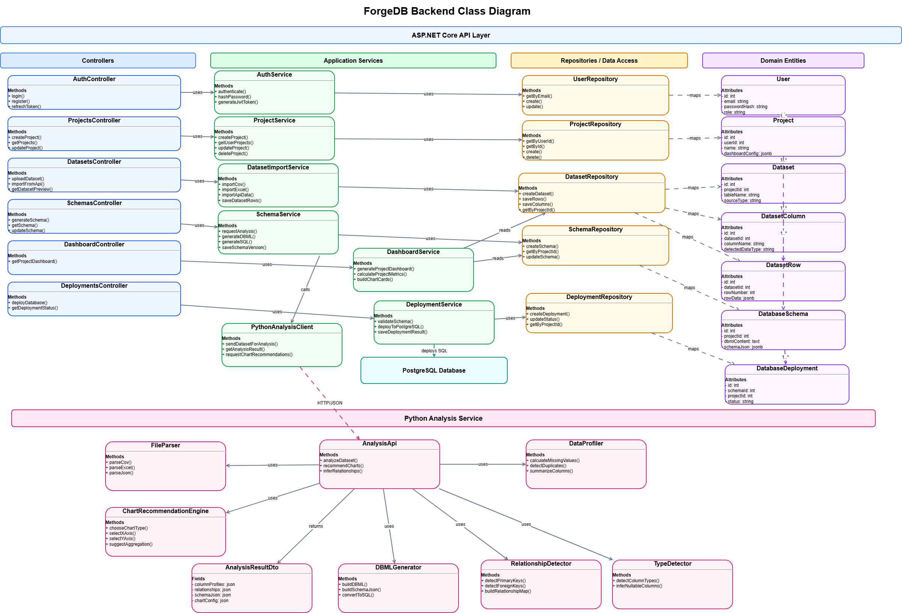

## Database Design

The database design supports project management, imported data storage, dataset analysis, generated DBML schemas, dashboard metrics, chart recommendations, and PostgreSQL deployment records. Dataset rows are stored as JSONB to support different data structures from different CSV, Excel, or API sources without creating a physical table for every uploaded file.

| Table Name | Purpose | Main Fields | Relationships / Notes |
| --- | --- | --- | --- |
| users | Stores ForgeDB system users and supports authentication and ownership of projects. | id (PK) first_name, last_name email (unique) password_hash role created_at | One user can own many projects. Ref: projects.user_id > users.id |
| projects | Represents a user project. A project can contain multiple imported/generated tables and a project-level dashboard. | id (PK) user_id (FK) name description dashboard_config (JSONB) created_at, updated_at | Belongs to one user. Has many datasets. Has many database schemas. |
| datasets | Represents one imported or generated table inside a project. Each dataset stores general table information and summary statistics. | id (PK) project_id (FK) table_name source_type (CSV, Excel, API) source_name, source_url row_count, column_count missing_values_count duplicate_rows_count status created_at | Belongs to one project. Has many dataset_columns. Has many dataset_rows. |
| dataset_columns | Stores column metadata and analysis results for each dataset column. | id (PK) dataset_id (FK) column_name detected_data_type missing_values_count unique_values_count is_nullable sample_values (JSONB) | Belongs to one dataset. Used for type detection, schema generation, and dashboard summaries. |
| dataset_rows | Stores the actual imported data rows using JSONB so ForgeDB can support different table structures. | id (PK) dataset_id (FK) row_number row_data (JSONB) created_at | Belongs to one dataset. Used for data preview, dashboard calculations, and analysis. |
| database_schemas | Stores the generated database design for the whole project, including DBML, structured schema JSON, and PostgreSQL SQL. | id (PK) project_id (FK) schema_name dbml_content schema_json (JSONB) sql_content version status created_at, updated_at | Belongs to one project. Can contain multiple tables and relationships inside DBML and schema_json. Has many deployments. |
| database_deployments | Stores deployment attempts and deployment status when the approved schema is deployed to PostgreSQL. | id (PK) schema_id (FK) project_id (FK) database_name status deployed_at | Belongs to one database_schema. Belongs to one project. Tracks deployment history and result. |

## Key Relationships

| Relationship | Type | Description |
| --- | --- | --- |
| users → projects | One-to-Many | One user can create and own multiple projects. |
| projects → datasets | One-to-Many | One project can contain multiple datasets, where each dataset represents an imported or generated table. |
| datasets → dataset_columns | One-to-Many | Each dataset has multiple columns with metadata such as detected data type, missing values, and sample values. |
| datasets → dataset_rows | One-to-Many | Each dataset has multiple stored rows. The row data is saved using JSONB to support flexible table structures. |
| projects → database_schemas | One-to-Many | One project can have multiple generated database schema versions, including DBML, schema JSON, and SQL. |
| database_schemas → database_deploym | One-to-Many | One database schema can be deployed multiple times, and each deployment attempt is recorded with its status. |
| projects → database_deployments | One-to-Many | Deployments are linked to the project so the system can track deployment history at the project level. |

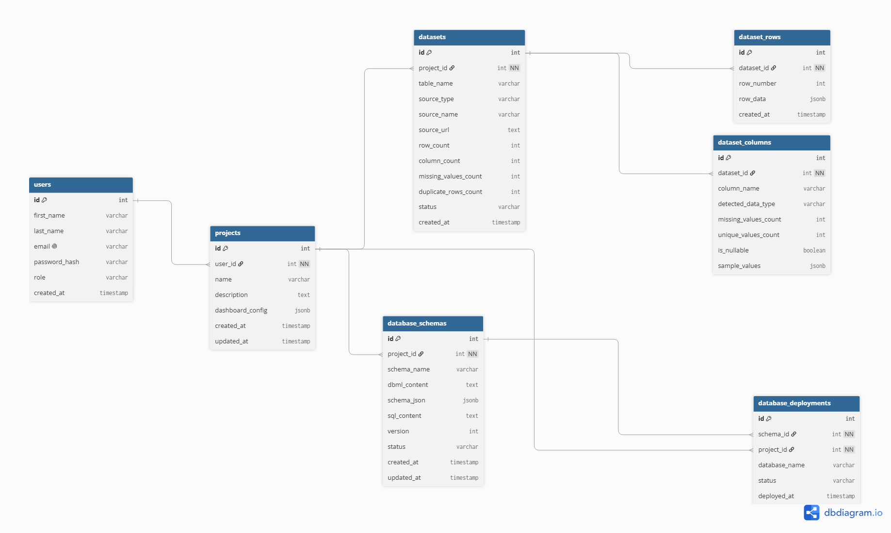

Description: The ER diagram shows the simplified ForgeDB database structure. It includes users, projects, datasets, dataset rows, dataset columns, database schemas, and database deployments. Each project can contain multiple datasets, and each dataset stores its imported rows using JSONB along with column metadata. The generated database design is stored as DBML and SQL inside the database schemas table, while dashboard data is generated from the stored dataset rows and columns.

# 3. High-Level Sequence Diagrams

## Upload and Analyze Dataset

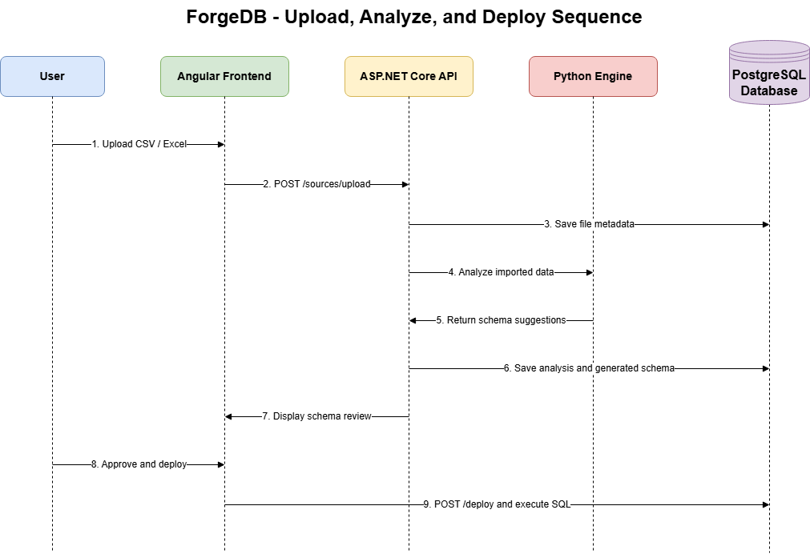

Description: The user uploads a CSV or Excel file, the backend saves the imported data, the analysis engine analyzes the dataset, and the system returns dataset metrics and schema suggestions.

## Connect External API

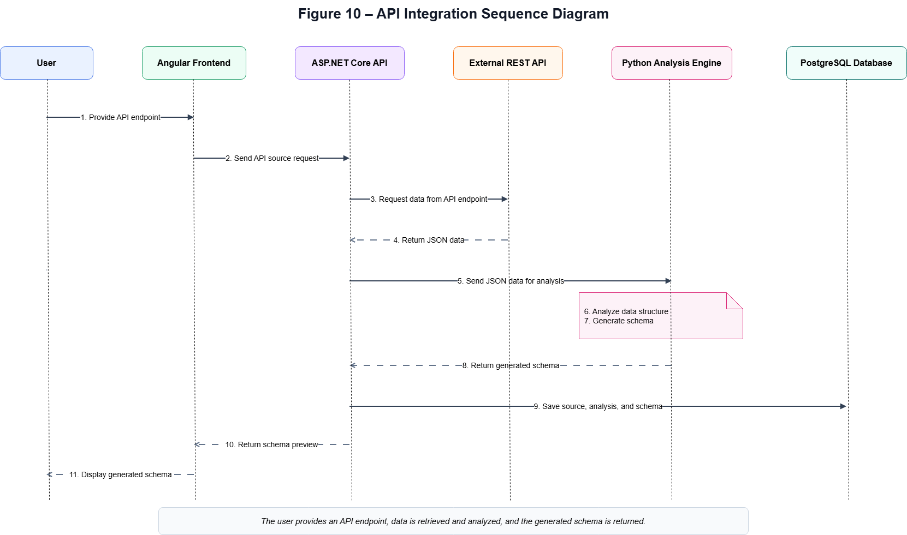

Description: The user provides an API endpoint, data is retrieved and saved, the dataset is analyzed, and the generated schema is returned.

## Deploy Database

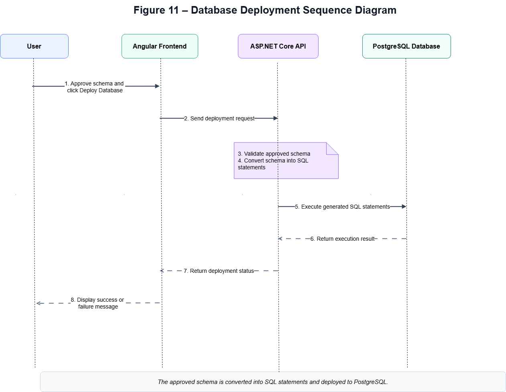

Description: The approved DBML schema is converted into PostgreSQL SQL statements and deployed to PostgreSQL.

## Optional AI-Assisted Chart Configuration

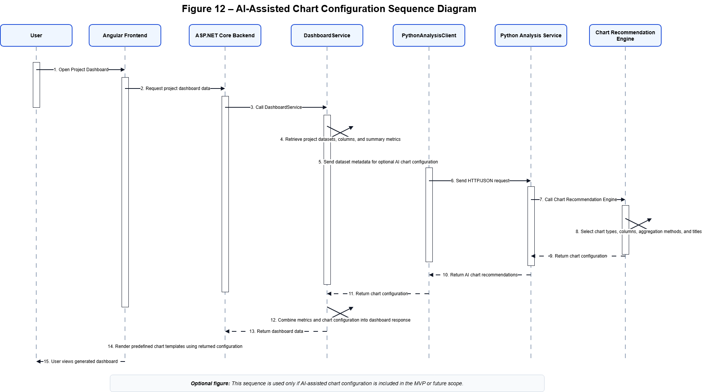

Description: The system sends dataset metadata to the optional AI assistant, the AI returns chart configurations, and the frontend renders charts using predefined chart templates.

# 4. External and Internal APIs

## External APIs

ForgeDB supports user-provided REST APIs as external data sources. These APIs return JSON data, which is saved inside ForgeDB, analyzed, and transformed into DBML and SQL-based database designs.

For privacy and performance, optional AI features should use dataset metadata, sample values, and analysis summaries instead of sending the full raw dataset to an AI service.

## Internal API Endpoints

| Endpoint | Description |
| --- | --- |
| POST /api/projects | Creates a new ForgeDB project. |
| GET /api/projects | Returns the user projects. |
| GET /api/projects/{projectId} | Returns a specific project. |
| POST /api/projects/{projectId}/sources/upload | Uploads a CSV or Excel file as a project data source. |
| POST /api/projects/{projectId}/sources/api | Connects an external REST API as a data source. |
| POST /api/projects/{projectId}/datasets | Creates and saves an imported dataset. |
| GET /api/projects/{projectId}/datasets | Returns all imported datasets for a project. |
| GET /api/datasets/{datasetId} | Returns dataset details and metadata. |
| GET /api/datasets/{datasetId}/preview | Returns a limited preview of stored dataset rows. |
| POST /api/datasets/{datasetId}/analyze | Analyzes the dataset and detects structure, data types, duplicates, missing values, and relationships. |
| GET /api/datasets/{datasetId}/dashboard | Returns fixed dashboard metrics and chart-ready summaries for a dataset. |
| POST /api/datasets/{datasetId}/chart-recommendations | Generates chart recommendations using predefined templates and optional AI assistance. |
| POST /api/projects/{projectId}/schemas | Creates and saves a generated database schema in DBML format. |
| GET /api/projects/{projectId}/schemas | Returns all saved database schemas for a project. |
| GET /api/schemas/{schemaId} | Returns a specific saved DBML schema. |
| PUT /api/schemas/{schemaId}/dbml | Updates the DBML content of a saved schema. |
| POST /api/schemas/{schemaId}/generate-sql | Converts the DBML schema into PostgreSQL SQL statements. |
| GET /api/schemas/{schemaId}/relationships | Returns detected relationships between generated tables. |
| POST /api/schemas/{schemaId}/deploy | Deploys the selected saved schema to PostgreSQL. |

## Example Chart Recommendation Response

The optional AI or recommendation logic should return configuration only. The frontend renders the result using predefined chart templates.

```json
{
  "dashboardTitle": "Dataset Overview",
  "charts": [
    {
      "chartType": "line",
      "title": "Total Sales Over Time",
      "xAxis": "order_date",
      "yAxis": "total_amount",
      "aggregation": "sum"
    },
    {
      "chartType": "bar",
      "title": "Orders by City",
      "xAxis": "city",
      "yAxis": "id",
      "aggregation": "count"
    }
  ]
}

```

# 5. SCM and QA Strategies

## Source Control Management

The project uses Git and GitHub for version control. The branching strategy should stay simple to reduce confusion during development.

- main: stable branch used for reviewed and accepted work.
- feature/*: separate branches used for developing individual features.

Each feature should be developed in a separate branch and merged into main through Pull Requests after review by at least one team member.

## Quality Assurance

| Testing Type | Plan |
| --- | --- |
| Unit Testing | xUnit for ASP.NET Core backend unit tests, and Jasmine/Karma for Angular frontend unit tests. |
| Integration Testing | Postman and Swagger can be used to test API endpoints and backend integration. |
| End-to-End Testing | Cypress can be used optionally to test the full workflow, such as upload data, review schema, and deploy database. |
| Manual Testing | Critical user workflows will be manually tested before release, especially upload, analysis, dashboard preview, DBML generation, SQL generation, and deployment. |

## Core Test Scenarios

- Upload a valid CSV file and verify that the dataset is saved.
- Upload an Excel file and verify that columns and rows are detected correctly.
- Connect an external REST API and verify that JSON data is retrieved and saved.
- Analyze a dataset and verify detected data types, missing values, duplicates, and relationships.
- View the fixed dataset dashboard and verify total rows, total columns, missing values, duplicates, and data preview.
- Generate DBML and verify that tables, columns, and relationships are represented correctly.
- Generate PostgreSQL SQL from DBML and verify that the SQL script is valid.
- Deploy the approved schema to PostgreSQL and verify deployment status.

# 6. Technical Justifications

| Decision | Justification |
| --- | --- |
| Angular | Angular was selected because it provides a scalable component-based architecture and strong TypeScript support for building structured dashboards and forms. |
| ASP.NET Core | ASP.NET Core was chosen because of its performance, security, and support for building RESTful APIs. |
| Python Analysis Engine | Python was selected for data analysis because of its strong ecosystem for data processing and future AI integration. |
| PostgreSQL | PostgreSQL was selected because ForgeDB focuses on relational database generation, JSONB dataset storage, relationship management, and PostgreSQL deployment. |
| DBML | DBML was selected as the main database design representation because it is readable, easy to edit, and can be converted into SQL. |
| JSONB Dataset Storage | JSONB allows ForgeDB to store rows from different datasets with different structures without creating a new physical table for every uploaded file. |
| Fixed Dataset Dashboard | A fixed dashboard keeps the MVP simple while still giving users useful insights about each imported dataset. |
| AI-Assisted Chart Configuration | AI is optional and limited to recommending chart configurations from predefined templates. This avoids the complexity of building a full AI dashboard generator. |
| REST Architecture | REST APIs provide a simple and scalable communication model between frontend and backend components. |
| Simple GitHub Flow | A simple branch strategy reduces collaboration complexity and supports code review through Pull Requests. |
| Testing Strategy | A combination of unit testing, integration testing, optional end-to-end testing, and manual testing helps ensure system quality and reliability. |

# 7. MVP Scope Control

To keep the project realistic, ForgeDB should focus on a limited but strong MVP. Advanced features should be documented as optional or future enhancements rather than required implementation items.

## MVP Scope

- Import data from CSV, Excel, and external REST APIs.
- Save imported data inside PostgreSQL using flexible JSONB row storage.
- Analyze datasets and detect column types, missing values, duplicates, and possible relationships.
- Generate DBML from the analyzed dataset.
- Generate PostgreSQL SQL from the approved DBML.
- Provide a simple fixed dashboard for each imported dataset.
- Deploy the approved schema to PostgreSQL.

## Optional / Future Enhancements

- AI-assisted chart configuration and chart titles.
- AI-assisted table and column naming suggestions.
- Advanced dashboard builder.
- DBML import/export.
- Schema version comparison.
- Full generated database documentation export.
- Support for MySQL, SQL Server, or Oracle.
- Real-time synchronization with external APIs.

# Appendix A – Figure Checklist

| Figure | Name | Suggested File Name | Source |
| --- | --- | --- | --- |
| Figure 1 | Dashboard Screen | dashboard-screen.png | Figma |
| Figure 2 | Upload Data Screen | upload-data-screen.png | Figma |
| Figure 3 | Dataset Analysis and Dashboard Screen | dataset-analysis-dashboard-screen.png | Figma |
| Figure 4 | Schema Review and DBML Screen | schema-review-dbml-screen.png | Figma |
| Figure 5 | Relationships Screen | relationships-screen.png | Figma |
| Figure 6 | Deployment Screen | deployment-screen.png | Figma |
| Figure 7 | ForgeDB Architecture Diagram | forgedb-architecture-diagram.png | Draw.io/Figma |
| Figure 8 | ForgeDB ER Diagram | forgedb-er-diagram.png | dbdiagram.io |
| Figure 9 | Upload & Analysis Sequence Diagram | sequence-upload-analysis.png | Draw.io |
| Figure 10 | API Integration Sequence Diagram | sequence-api-analysis.png | Draw.io |
| Figure 11 | Database Deployment Sequence Diagram | sequence-database-deployment.png | Draw.io |
| Figure 12 | AI-Assisted Chart Configuration Sequence Diagram | sequence-ai-chart-configuration.png | Optional |
